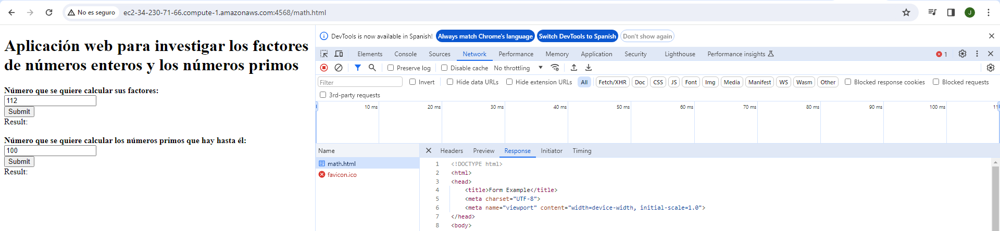
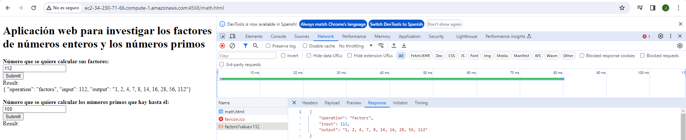
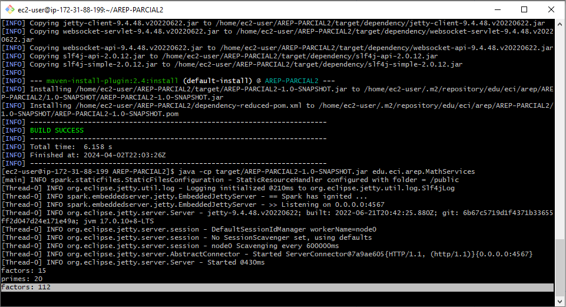
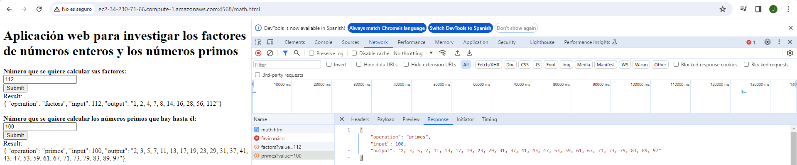
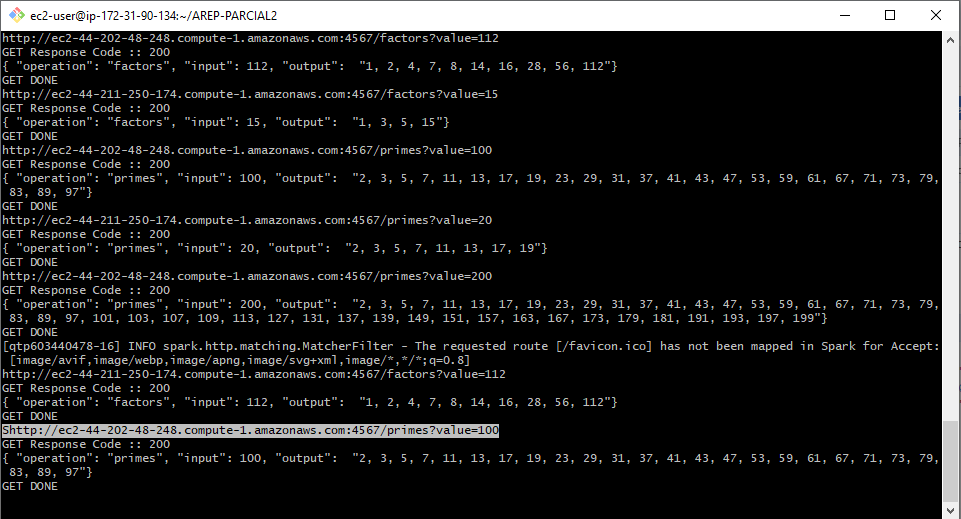
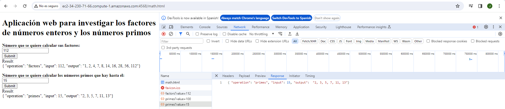
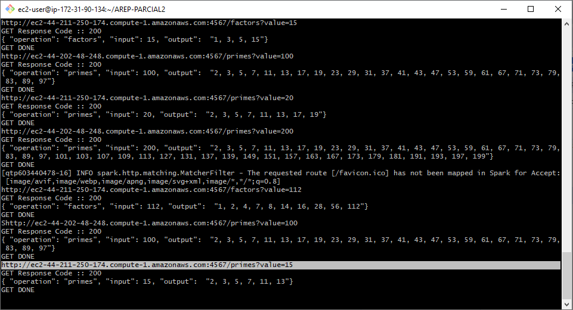

# AREP-PARCIAL2

Aplicación web para investigar los factores de números enteros y los números primos. El programa está desplegado en tres máquinas virtuales de EC2 de AWS. Las tecnologías usadas en la solución son maven, git, github, sparkjava, html5, y js.

## Comenzando

Estas instrucciones te ayudarán a obtener una copia del proyecto en funcionamiento en tu máquina local para fines de desarrollo y pruebas.

### Requisitos previos

* Kit de desarrollo de Java (JDK) versión 11 o posterior
* Herramienta de construcción Maven
* Git

### Correrlo en EC2.

1. Clona el repositorio en tres o más instancias de EC2:
    ```
    git clone https://github.com/AlexisGR117/AREP-PARCIAL2.git
    ```
2. En cada instancia de EC2 navega a la carpeta del proyecto:
    ```
    cd AREP-PARCIAL2
    ```
3. En cada instancia de EC2 construye el proyecto usando Maven:
    ```
    mvn clean install
    ```
4. En la instancia que se encargará del proxy configura las variables de entorno con el siguiente comando, ten en cuenta que \<services> son las URLs de las demás intancias que se encargarán de los servicios MathServices separados por comas:
    ```
    export MATH_SERVICES=<services>
    ```
   ejemplo del uso del comando:
    ```
    export MATH_SERVICES=http://ec2-44-202-48-248.compute-1.amazonaws.com:4567,http://ec2-44-211-250-174.compute-1.amazonaws.com:4567
    ```
5. Ejecuta ServiceProxy en la instancia que se encargará del proxy:
    ```
    java -cp target/AREP-PARCIAL2-1.0-SNAPSHOT.jar edu.eci.arep.ServiceProxy
    ```
6. Ejecuta MathServices en las demás intancias que creaste:
    ```
    java -cp target/AREP-PARCIAL2-1.0-SNAPSHOT.jar edu.eci.arep.MathServices
    ```
7. Abre un navegador web y accede a la aplicación con la url de la instancia que se encarga del proxy por ejemplo, debe usarse el puerto 4568 y se la ruta será /math.html:

    http://ec2-34-230-71-66.compute-1.amazonaws.com:4568/math.html.

### Ejecutando las pruebas

Ejecuta las pruebas unitarias:
```
mvn test
```

## Arquitectura


Este proyecto implementa un prototipo de sistema de microservicios que comprende los siguientes componentes:

* **Math Services**

   Este servicio se encarga de calcular los factores y números primos de un número entero dado. Está implementado en Java utilizando Spark y desplegado en al menos dos instancias de EC2 de AWS. Las dos funciones que ofrece son:
   
   * **factors(n)**: Retorna un JSON con la lista de factores del número n.
   * **primes(n)**: Retorna un JSON con la lista de números primos menores o iguales a n.

* **Service Proxy**

   El proxy recibe las solicitudes de los clientes y las delega a las instancias Math Services utilizando un algoritmo de round-robin. Está implementado en Java con Spark y desplegado en una instancia de EC2 de AWS separada. Las direcciones y puertos de las instancias del Servicio de Funciones Numéricas se configuran en el proxy mediante variables de entorno del sistema operativo.

* **Cliente Web**

   El cliente web consta de un formulario HTML y JavaScript que permite al usuario ingresar un valor numérico. Cuando el usuario envía el formulario, se realiza una solicitud asíncrona al proxy utilizando una petición HTTP GET. El proxy, a su vez, delega la solicitud a una de las instancias de Math Services, y la respuesta JSON se muestra en el cliente web.
   
La comunicación entre los componentes se realiza a través de solicitudes HTTP GET, donde el parámetro value se pasa como variable de consulta. Las respuestas se devuelven en formato JSON con la estructura indicada en el enunciado.
   
Esta arquitectura basada en microservicios permite una escalabilidad y distribución eficientes de la carga de trabajo, al tiempo que mantiene una separación de responsabilidades clara entre los diferentes componentes del sistema.

## Evaluación

### Caso de prueba 1 - Prueba de cálculo de factores:


**Objetivo:** Verificar que el servicio factors(n) calcula correctamente los factores de un número.

**Entrada:** Un número entero positivo, por ejemplo, 112.

**Salida:** Un JSON con la lista de factores del número, en este caso: {"operation": "factors", "input": 112, "output": "1, 2, 3, 4, 7, 8, 14, 16, 28, 56, 112"}.

Se accede a la aplicación por medio de la url de la instancia que se encarga del proxy, teniendo en cuenta que el puerto es el 4568 y la ruta /math.html.



Se ingresa el número que se quiere calcular los factores, en este caso 112 y se oprime el botón "Submit". La respuesta a esta petición debe ser un JSON con la información de la operación.



Se revisa la instancia del proxy para ver que se haya hecho correctamente la petición a un MathService y que la respuesta de este sea un JSON con la información de la operación.



### Caso de prueba 2 - Prueba de cálculo de números primos:

**Objetivo:** Verificar que el servicio primes(n) calcula correctamente los números primos.

**Entrada:** Un número entero positivo, por ejemplo, 100.

**Salida:** Un JSON con la lista de números primos menores o iguales a 20, en este caso: {"operation": "primes", "input": 100, "output": "2, 3, 5, 7, 11, 13, 17, 19, 23, 29, 31, 37, 41, 43, 47, 53, 59, 61, 67, 71, 73, 79, 83, 89, 97"}.

Calculamos los números primos que hay desde 1 hasta 100. La respuesta a esta petición debe ser un JSON con la información de la operación.



Se vuelve a revisar la instancia del proxy, esta vez la petición se debe realizar a otro servicio totalmente diferente al de la anterior petición y de igual forma se debe obtener como respuesta un JSON con la información de la operación.



### Caso de prueba 3 - Prueba de balanceo de carga (round-robin) en el proxy:

**Objetivo:** Verificar que el proxy distribuye las solicitudes entre las instancias de Math Services utilizando el algoritmo de round-robin.

**Entrada:** Múltiples solicitudes a través del cliente web.

**Salida:** Las solicitudes se deben distribuir equitativamente entre las instancias del Servicio de Funciones Numéricas.

Para verificar el algoritmo de round-robin volvemos a calcular los números primos que hay hasta el número 15.



En la instancia de proxy se podrá ver que la petición cambio de servicio, esta vez al primero que se había usado para calcular los factores de 112.



### Video con las pruebas y los despliegues funcionando

https://pruebacorreoescuelaingeduco.sharepoint.com/:v:/s/PruebaC/EQoUhspB-qZNpDqhbbCMveAB8DKeIrZ5ub17x9EYWfoXUQ?e=3pIW2I&nav=eyJyZWZlcnJhbEluZm8iOnsicmVmZXJyYWxBcHAiOiJTdHJlYW1XZWJBcHAiLCJyZWZlcnJhbFZpZXciOiJTaGFyZURpYWxvZy1MaW5rIiwicmVmZXJyYWxBcHBQbGF0Zm9ybSI6IldlYiIsInJlZmVycmFsTW9kZSI6InZpZXcifX0%3D

## Authors

* Jefer Alexis González Romero
